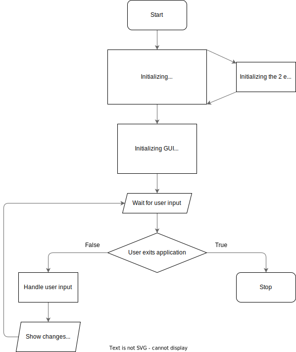

# elevator_controller

The solution for the task specified below. (By Dobai Balázs, in python 3.10.9)

The task: (from WebGurus)

"Your mission should you choose to accept it, is to design a system that controls the elevator in a building with 7 storeys (indexed 0-6). A visual interface (UI) is optional but it's recommended. Focus on working with functions and objects first.

Below you’ll find the requirements for the application and a breakdown of the fields to be used.

You shall deliver the **code for this application** and **picture/s for the diagrams** that illustrate your understanding of the application logic.

Details
There are 7 floors in a block and only 2 lifts. Initially Lift A is at the ground floor and Lift B at the top floor. Whenever someone calls the lift from N th floor, the lift closest to that floor comes to pick him up. If both the lifts are at equidistant from the N th floor, them the lift from the lower floor comes up.

There are navigation buttons in each floor (up / down). Inside the elevator there are buttons to select the destination. Seven segment displays indicate the position of the lift. These are present inside the elevator. There are arrows to indicate the direction of movement of the elevator in each floor.

The following changes cause state transitions:

1.The elevator is called from one of the floors.
2.The destination has been reached.
3.The destination has been selected.
***For simplicity, only one destination can be selected.

Functionality needed:
For each elevator, display its current state.

For each floor, display which elevator is going up/down

Requirements
You have 4 day from the moment you receive the problem to ask any relevant question about the specifications. You have 5 days to submit your code that implements the above mentioned functionalities. The code should be added to a public git repository, we strongly recomment github for this.

We will take into consideration your thinking, logic, coding style and your code organization and structure as well as the correctness of the provided solution."

Diagram:

